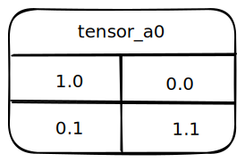

# 🍉 GGML

## Overview

GGML is a C library for ML - the "GG" refers to the author ([Georgi Gerganov](https://ggerganov.com/)). It defines:

* Low-level ML primitives like the tensor type
* The binary format for distributing LLMs

It makes use of technique <mark style="color:red;">**quantization that allows for LLMs to run on consumer hardware.**</mark>

### The Binary Format

GGML files consists of <mark style="color:blue;">**binary-encoded data that is laid out according to a specified format**</mark>. The format <mark style="color:purple;">**specifies what kind of data is present in the file**</mark>, <mark style="color:red;">**how it is represented**</mark>, and <mark style="color:green;">**the order**</mark> in which it appears.

The <mark style="color:purple;">**first piece**</mark> of information present in GGML file is a <mark style="color:purple;">**GGML version number,**</mark> it uses <mark style="color:orange;">**three components**</mark> that define a LLM:

* The model's Hyperparameters
* Vocabulary
* Weights

### GGML Versions

#### Support backwards-compatibility

GGML uses <mark style="color:orange;">**versioning**</mark> to introduce improvements that may change the format of the encoding.

### [Hyperparameters](https://en.wikipedia.org/wiki/Hyperparameter\_\(machine\_learning\))

It uses to describes a value that is used to configure the behavior of a large language model;

It is in contrast to the model's parameters like the weights that were derived in the training process that was used to create the model.

Each model defines its own hyperparameter structure that defines the hyperparameter values accepted by that model.

<mark style="color:purple;">**Each model defines its own hyperparameter structure**</mark> that <mark style="color:purple;">**defines the hyperparameter values**</mark> accepted by that model. And valid GGML files must <mark style="color:red;">**list these values**</mark> in the <mark style="color:red;">**correct order**</mark> and each of them must be represented using the <mark style="color:red;">**correct data type**</mark>.

Although hyperparameters are different across models, the most models have:

* \`n\_vocab\` the size of the model's <mark style="color:blue;">**vocabulary**</mark>
* \`n\_embd\` the size of the model's <mark style="color:blue;">**embedding**</mark> layer, which is used during prompt ingestion
* \`n\_layer\` the number of layers in the model, each layer represents a set of <mark style="color:blue;">**weights**</mark>.

### Vocabulary

<mark style="color:blue;">**As the name implies**</mark>, a model's vocabulary comprises components that are used by the model to generate language (text).

The <mark style="color:blue;">**vocabulary of a LLM**</mark> <mark style="color:red;">**consists**</mark> of "<mark style="color:red;">**tokens**</mark>". A token <mark style="color:green;">**can be an entire word**</mark>, but oftentimes they are <mark style="color:orange;">**word**</mark><mark style="color:orange;">\*\*</mark> <mark style="color:orange;"></mark>_<mark style="color:orange;">**fragments**</mark>_. \*\*<mark style="color:blue;">**LLM use tokens to express a large number of words form a relatively smaller number of components.**</mark>

For example, Consider a vocabulary with the following tokens: `whi`, `ch` `le`, `who`, and `a`; This vocabulary can be used to create the English words. With the vocabulary like this, the model-creator can tune the models' behavior and performance.

The model's hyperparameters typically contains a value that specifies the number of tokens in the vocabulary. The vocabulary is encoded as a list of tokens, each of which includes a 32-bit integer that specifies the length of the token. And it depends on different GGML version, the token may also include 32-bit floating point score, which represents the frequency of that token in the model's training data.

### Weight

LLMs can be improved by increasing the number of _weights_ in the model.<mark style="color:blue;">**The total number of a weights in a model are referred to as the "size" of that model.**</mark> For example, the [StableLM](https://github.com/Stability-AI/StableLM) implementation of the [GPT-NeoX](https://github.com/EleutherAI/gpt-neox) language model architecture is available in a number of sizes, like 3B and 7B, which stands for 3-billion and 7-billion, respectively.

These numbers above refer to the total number of weights in the model. <mark style="color:purple;">**Weights are grouped together in sets called "layers"**</mark>, and <mark style="color:red;">**within a layer**</mark> <mark style="color:purple;">**weights are grouped together in structures**</mark> called "<mark style="color:purple;">**tensors**</mark>".

So, for instance, both StableLM 3B and StableLM 7B use layers that comprise the same tensors, but StableLM 3B has relatively _<mark style="color:red;">**fewer**</mark>_<mark style="color:red;">\*\* \*\*</mark><mark style="color:red;">**layers**</mark> when compared to StableLM 7B.

#### Tensor

In GGML, a tensor consists of a number of components, including:

* Name
* 4-element list that represents the number of dimensions in the tensor and their lengths
* A list of the weights in that tensor

#### Representing tensor in GGML

\`{"tensor\_a0", \[2, 2, 1, 1], \[1.0, 0.0, 0.1, 1.0]}\` Note that the 4-element list of dimensions uses `1` as a placeholder for unused dimensions - this is because the product of the dimensions should not equal zero.

The <mark style="color:orange;">**weights in a GGML file are encoded as a list of layers**</mark>, the <mark style="color:blue;">**length**</mark> of which is typically specified <mark style="color:blue;">**in the model's hyperparameter**</mark>**s**; each layer is encoded as an ordered set of tensors.

## Features

### Integer Quantization

Integer quantization support means that the library can convert data from <mark style="color:red;">**floating-point format**</mark> (such as FP32) to <mark style="color:red;">**integer format**</mark> (such as INT8) and perform computations using integers instead of floating-point numbers¹. <mark style="color:blue;">**This can reduce the memory**</mark> and computing requirements of the library, as well as <mark style="color:blue;">**improve the performance on some hardware platforms**</mark>². <mark style="color:red;">**However**</mark>, <mark style="color:red;">**integer**</mark> quantization also <mark style="color:red;">**introduces some error and loss of precision**</mark>, so the library has to use some techniques to recover the accuracy and maintain the quality of the results³.

### Automatic Differentiation

Automatic differentiation means that the library can <mark style="color:red;">**evaluate the partial derivative of a function**</mark> <mark style="color:red;">**specified by a computer program**</mark>[¹](https://en.wikipedia.org/wiki/Automatic\_differentiation). This is useful for machine learning because <mark style="color:purple;">**many algorithms require computing gradients of functions**</mark> for optimization or learning purposes. Automatic differentiation uses the **chain rule** of <mark style="color:red;">**calculus**</mark> to apply symbolic rules for differentiation to <mark style="color:red;">**elementary arithmetic operations**</mark> and functions[²](https://www.mathworks.com/help/deeplearning/ug/deep-learning-with-automatic-differentiation-in-matlab.html). This way, it can compute derivatives **accurately** and **efficiently** without relying on finite difference approximations or symbolic manipulation[¹](https://en.wikipedia.org/wiki/Automatic\_differentiation).

### Optimizers for Loss Function

<mark style="color:red;">**ADAM**</mark> and <mark style="color:red;">**L-BFGS**</mark> are two types of <mark style="color:purple;">**optimizers**</mark> that are used to find the _<mark style="color:blue;">**optimal values of the parameters of a function by minimizing a loss function**</mark>_[¹](https://www.researchgate.net/figure/A-comparison-of-the-performance-of-the-Adam-optimizer-an-algorithm-for-first-order\_fig3\_360640362). They are both based on the **gradient descent** method, which updates the parameters in the opposite direction of the gradient of the loss function[²](https://stats.stackexchange.com/questions/315626/the-reason-of-superiority-of-limited-memory-bfgs-over-adam-solver).

ADAM stands for **adaptive moment estimation** and is a popular optimizer for deep learning models[²](https://stats.stackexchange.com/questions/315626/the-reason-of-superiority-of-limited-memory-bfgs-over-adam-solver). It uses <mark style="color:blue;">**adaptive learning rates**</mark> for each parameter based on the first and second moments (_<mark style="color:red;">**mean and variance**</mark>_) of the gradients[³](https://en.wikipedia.org/wiki/Limited-memory\_BFGS). It also incorporates <mark style="color:red;">**momentum**</mark>, which helps to <mark style="color:red;">**accelerate**</mark> the convergence and avoid local minima[³](https://en.wikipedia.org/wiki/Limited-memory\_BFGS).

L-BFGS stands for **limited-memory Broyden–Fletcher–Goldfarb–Shanno** and is a quasi-Newton optimizer that approximates the inverse Hessian matrix using a limited amount of memory[⁴](https://www.researchgate.net/publication/322652684\_Seismic\_Full-Waveform\_Inversion\_Using\_Deep\_Learning\_Tools\_and\_Techniques). It uses a line search algorithm to find the optimal step size along the search direction[⁴](https://www.researchgate.net/publication/322652684\_Seismic\_Full-Waveform\_Inversion\_Using\_Deep\_Learning\_Tools\_and\_Techniques). It is <mark style="color:orange;">**often**</mark> <mark style="color:orange;">**faster**</mark> and <mark style="color:orange;">**more accurate than gradient descent**</mark>, but <mark style="color:orange;">**requires more computation and memory**</mark>[⁴](https://www.researchgate.net/publication/322652684\_Seismic\_Full-Waveform\_Inversion\_Using\_Deep\_Learning\_Tools\_and\_Techniques).

### Intrinsic AVX/AVX2 on x86

The x86 architectures are a family of processors that use a 32-bit or 64-bit instruction set. AVX and AVX2 are extensions of the x86 instruction set that enable **advanced vector extensions** for parallel processing of data[²](https://www.intel.com/content/www/us/en/docs/cpp-compiler/developer-guide-reference/2021-8/intrinsics-for-avx2.html). Intrinsics are functions that provide access to these extensions without writing assembly code[²](https://www.intel.com/content/www/us/en/docs/cpp-compiler/developer-guide-reference/2021-8/intrinsics-for-avx2.html). Therefore, x86 architectures that utilize AVX / AVX2 intrinsics can perform faster and more efficient computations on large amounts of data, such as tensors for machine learning.

## Reference

* Basics of Quantization in Machine Learning (ML) for Beginners. https://iq.opengenus.org/basics-of-quantization-in-ml/
* What Is int8 Quantization and Why Is It Popular for Deep Neural .... https://www.mathworks.com/company/newsletters/articles/what-is-int8-quantization-and-why-is-it-popular-for-deep-neural-networks.html
* \[2004.09602] Integer Quantization for Deep Learning Inference .... https://arxiv.org/abs/2004.09602.
* [rustformers/llm](https://github.com/rustformers/llm)
* [ggerganov/ggml](https://github.com/ggerganov/ggml)
