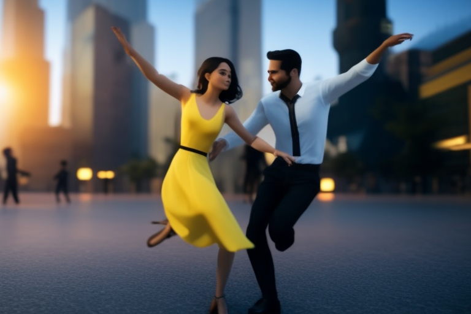

# 🗺 Depth maps

Overview

Depth-to-image (Depth2img) is an under-appreciated model in Stable Diffusion v2. _<mark style="color:red;">**It is an enhancement to image-to-image (img2img)**</mark>_ which takes advantage of the depth information when generating new images.

_<mark style="color:red;">**With depth-to-image, you have better control of synthesizing subject and background separately.**</mark>_

In depth-to-image, Stable Diffusion takes an image and a prompt as inputs (similar with image-to-image). The model first estimates the depth map of the input image using [MIDas](https://github.com/isl-org/MiDaS), _<mark style="color:red;">**an AI model developed in 2019 for estimating**</mark>_ [_<mark style="color:red;">**monocular depth perception**</mark>_](https://en.wikipedia.org/wiki/Depth\_perception) _<mark style="color:red;">**(that is estimating depth from a single view).**</mark>_ The depth map is then used by Stable Diffusion as an extra [**conditioning** ](conditioning.md)to image generation.

Depth-to-image uses three conditionings to generate a new image

* test prompt
* original image
* depth map

Equipped with the depth map, the model has _some_ knowledge of the three-dimensional composition of the scene. **Image generations of foreground objects and the background can be separated.**

## Depth map

_<mark style="color:green;">**A depth map is a simple gray scale image of the same size of the original image encoding the depth information.**</mark>** **<mark style="color:red;">**Complete white means the object is closest to you. More black means further away.**</mark>_

Here’s an example of an image and its depth map estimated by MIDaS.

.png>).png>)

## What can depth-to-image do

Here is an example of denoising strength for both image-to-image and depth-to-image.

<figure><figcaption>
Original image
</figcaption></figure>

<figure><figcaption>
Comparing image-to-image and depth-to-image.
</figcaption></figure>

Here we can see the image-to-image generations (top row). We ran into a problem: at low denoising strength, the image didn't change enough. At high denoising strength, we do see two wrestlers but the original composition is lost.

_<mark style="color:red;">**Depth-to-image resolves this problem.**</mark>_ You can crank up denoising strength all the way to 1 (the maximum) without losing the original composition.

## Some useful points with depth image

### Inpainting

If we care about preserving the original composition

.png>).png>)

### Style transfer

We can dial denoising strength all the way up to 1 without losing composition. That makes transforming a scene to a different style easy.

.png>).png>).png>)

## Summary

Depth-to-image is a great alternative to image-to-image, especially when you want to preserve the composition of the scene.

## Credit


