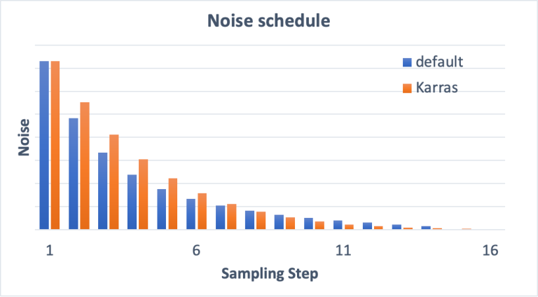

# 🍁 Diffusion sampling/samplers

## Overview

There are many sampling methods available in AUTOMATIC1111.

* What are samplers?
* How do they work?
* What is the difference between them?
* Which one should you use?

## What is the Sampling?

<figure><figcaption>
<mark style="color:red;"><strong>The sampler is responsible for carrying out the</strong></mark> <a href="denoising-strength.md"><mark style="color:red;"><strong>denoising</strong></mark> </a><mark style="color:red;"><strong>steps.</strong></mark>
</figcaption></figure>

The produce an image, Stable Diffusion first generates a completely random image in the latent space. The [noise predictor](diffusion-in-image.md#noise-predictor) then estimates the noise of the image. The predicted noise is subtracted from the image. This process is repeated a dozen times. In the end, we will get a clean image.

This [denoising ](denoising-strength.md)process is called _<mark style="color:red;">**sampling**</mark>_ because Stable Diffusion generates a new sample image in each step. The method used in sampling is called the <mark style="color:red;">**sampler**</mark> of <mark style="color:red;">**sampling method**</mark>.&#x20;

Below is a sampling process in action. The sampler gradually produces cleaner and cleaner images.

<figure><figcaption>
Images after each denoising step.
</figcaption></figure>

<mark style="color:orange;">**While the framework is the same**</mark>, <mark style="color:orange;">**there are many ways to carry out this denoising process**</mark>. It is often <mark style="color:orange;">**a trade-off**</mark> between <mark style="color:orange;">**speed**</mark> and <mark style="color:orange;">**accuracy**</mark>.

## Noise schedule

The noisy image gradually turns into a clear one in the picture above. The [noise schedule controls the noise level at each sampling step](stable-diffusion-workflow.md#noise-schedule). The noise is highest at the first step and gradually reduces to zero at the last step.

At each step, the sampler's job is to **produce an image with a noise level matching the noise schedule.**

<figure><figcaption>
Noise schedule for 15 sampling steps.
</figcaption></figure>

What's the effect of increasing the _**number of sampling steps**_? A smaller noise reduction between each step. This helps to _<mark style="color:red;">**reduce the truncation error of the sampling**</mark>_.

Compare the noise schedules of 15 steps and 30 steps below.

<figure><figcaption>
Noise schedule for 30 sampling steps.
</figcaption></figure>

## Samplers overview

What are the differences between them?

<figure><figcaption>
Samplers in AUTOMATIC1111
</figcaption></figure>

### Old-School ODE solvers

#### Euler

The simplest possible solver

#### Heun

A more accurate but slower version of Euler

#### LMS

(Linear multi-step method) Same speed as Euler but (supposedly) more accurate.

### Ancestral samplers

An <mark style="color:red;">**ancestral sampler**</mark> adds noise to the image at each sampling step. They are <mark style="color:red;">**stochastic**</mark> samplers because the sampling outcome has some randomness to it.

Be aware that many others are also stochastic samplers, even though their names do not have an "a" in them.

The drawback of using an ancestral sampler is that the image would not converge. Compare the images generated using Euler a and Euler below.

<figure><figcaption>
<strong>Euler a</strong> does not converge. (sample steps 2 – 40)
</figcaption></figure>

<figure><figcaption>
<strong>Euler</strong> converges. (sampling steps 2-40)
</figcaption></figure>

Images generated with Euler "a" do not converge at high sampling steps. In contrast, images from Euler converge well.

<mark style="color:red;">**For reproducibility, it is desirable to have the image converge**</mark>. If you want to generate slight variations, you should use _<mark style="color:red;">**variational seed\[#TODO]**</mark>_.

### Karras noise schedule

The samplers with the label "**Karras**" use the **noise schedule** recommended in the [**Karras article**](https://arxiv.org/abs/2206.00364)**.** As you can see the noise step sizes are smaller near the end. They found that this improves the quality of images.

<figure><figcaption>
Comparison between the default and Karras noise schedule.
</figcaption></figure>

### DDIM and PLMS

DDIM (Denoising Diffusion Implicit Model) and PLMS (Pseudo Linear Multi-Step method) were the samplers shipped with the original [Stable Diffusion v1](https://github.com/CompVis/stable-diffusion). DDIM is one of the first samplers designed for diffusion models. PLMS is a newer and faster alternative to DDIM.

They are generally seen as outdated and not widely used anymore.

### DPM and DPM++

**DPM** (Diffusion probabilistic model solver) and **DPM++** are new samplers designed for diffusion models released in 2022. They represent a family of solvers of similar architecture.

**DPM** and **DPM2** are similar except for DPM2 being second order (More accurate but slower).

**DPM++** is an improvement over DPM.

**DPM adaptive** adjusts the step size adaptively. It can be slow since it doesn’t guarantee finishing within the number of sampling steps.

### UniPC

[UniPC](https://unipc.ivg-research.xyz/) (Unified Predictor-Corrector) is a new sampler released in 2023. Inspired by the predictor-corrector method in ODE solvers, it can achieve high-quality image generation in 5-10 steps.

### k-diffusion

It simply refers to Katherine Crowson’s [k-diffusion](https://github.com/crowsonkb/k-diffusion) GitHub repository and the samplers associated with it. The repository implements the samplers studied in the[ Karras 2022](https://arxiv.org/abs/2206.00364) article. Basically, all samplers in AUTOMATIC1111 except DDIM, PLMS, and UniPC are borrowed from k-diffusion.

## Credit


